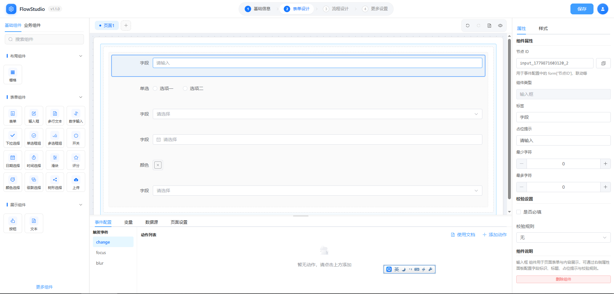
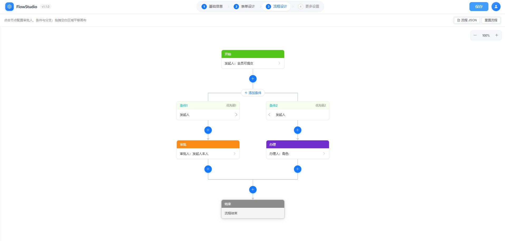

# FlowStudio

一个用于构建企业工作流、事件编排与动态应用的可视化低代码平台。

## 技术栈

- Vue 3 + Element Plus + Pinia + Vite
- JSON Schema 驱动页面与事件配置
- `packages/designer-event` 事件动作链引擎
- `packages/designer-workflow` 流程设计（`workflow-canvas` 画布与节点配置）

## 快速开始

```bash
npm install
npm run dev    # 设计器 + 文档预览（自动打开两个页面）
npm run docs   # 仅打开文档预览
```

## 页面截图

### 设计器总览



### 流程设计



## 文档

- [docs/README.md](./docs/README.md) — 文档索引
- [docs/event-user-guide.md](./docs/event-user-guide.md) — 事件配置使用指南
- [docs/lowcode-design.md](./docs/lowcode-design.md) — 平台设计说明
- [docs/workflow-design.md](./docs/workflow-design.md) — 流程设计模块与 Monorepo 集成
